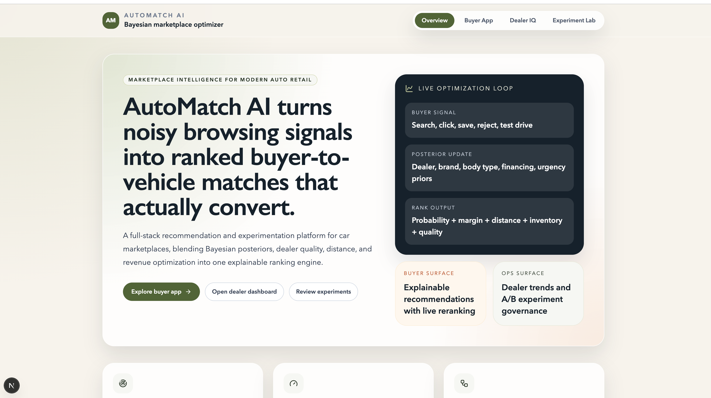
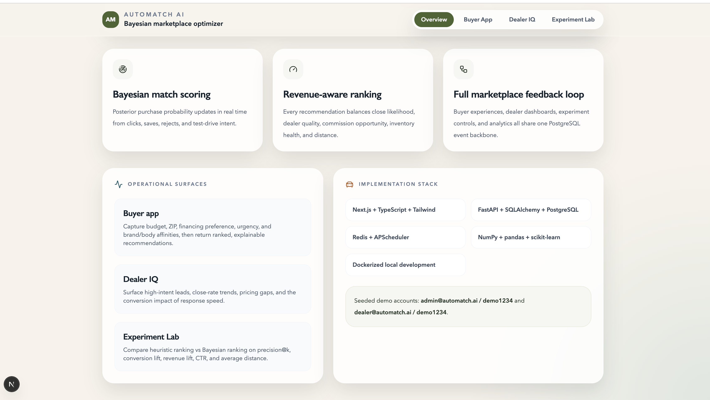
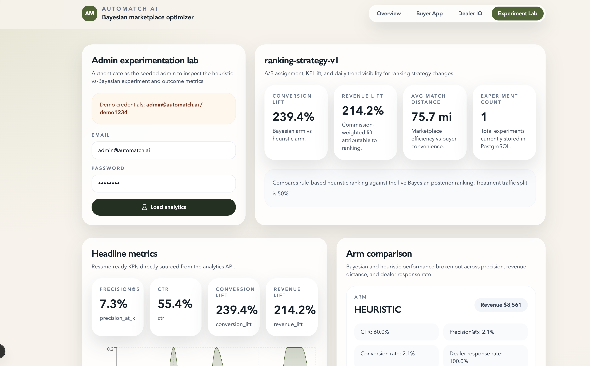
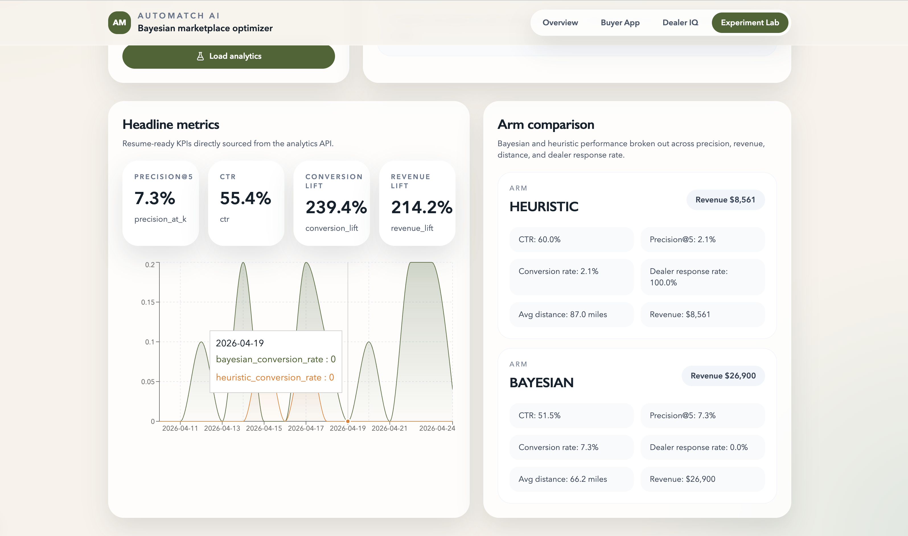
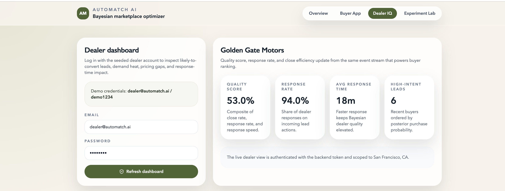
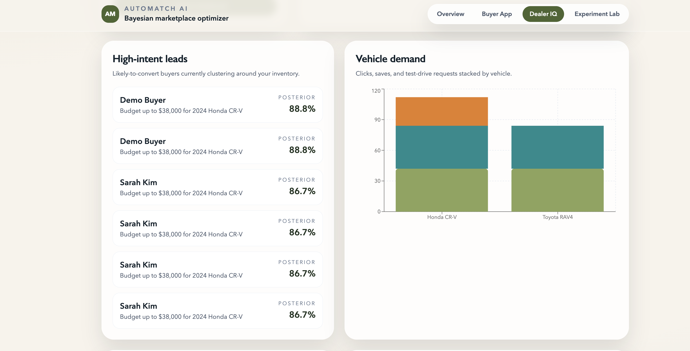
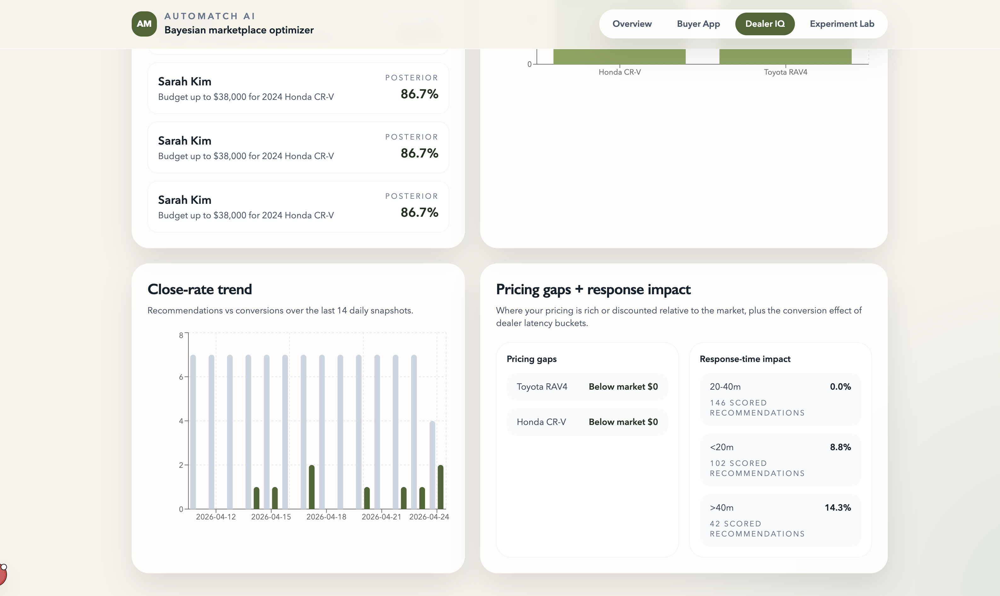
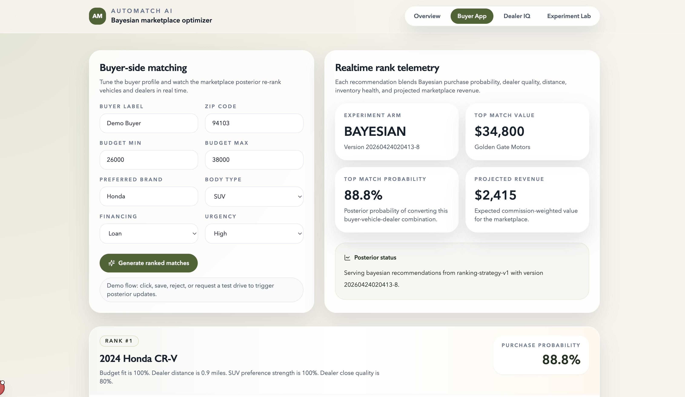
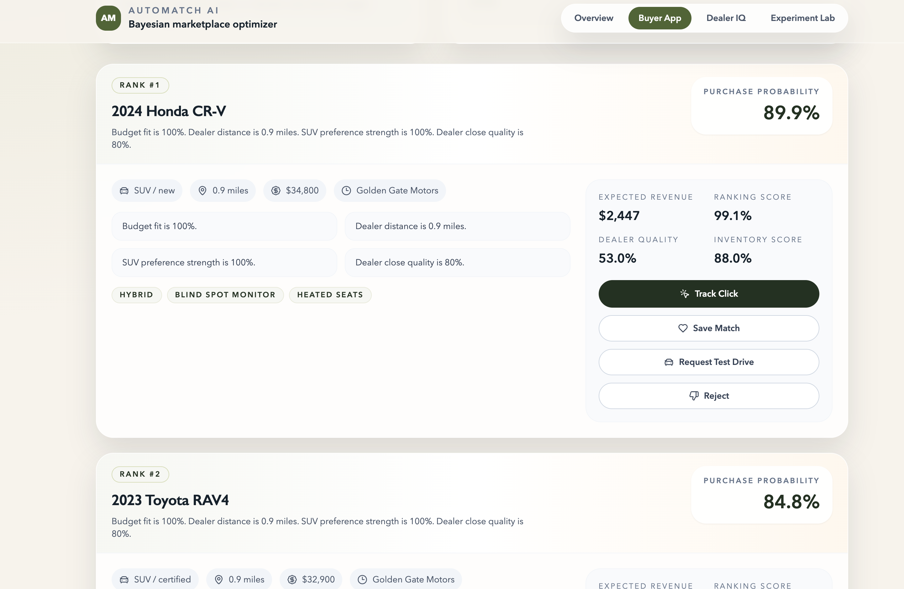

# AutoMatch AI

AutoMatch AI is a full-stack Bayesian buyer-to-vehicle marketplace optimization platform built with `Next.js`, `TypeScript`, `Tailwind`, `FastAPI`, `PostgreSQL`, `SQLAlchemy`, `Redis`, `APScheduler`, `pandas`, `NumPy`, `scikit-learn`, and `Docker`.

It combines a buyer-facing recommendation experience, a dealer intelligence dashboard, and an admin experimentation surface around one shared event pipeline. Rankings update from live buyer actions and optimize for more than just conversion probability: dealer quality, projected commission, inventory availability, and distance all contribute to the final match score.

## What is included

- Buyer recommendation app with budget, ZIP code, brand, body type, financing, urgency, and live re-ranking.
- Bayesian posterior engine that updates priors from clicks, saves, rejects, dealer responses, and conversions.
- Revenue-aware ranking that balances conversion probability, dealer quality, projected revenue, and inventory health.
- Dealer dashboard for high-intent leads, demand signals, close-rate trends, pricing gaps, and response-time impact.
- Admin dashboard for heuristic-vs-Bayesian A/B testing and KPI comparison.
- PostgreSQL-backed schema for buyers, vehicles, dealers, events, recommendations, experiments, assignments, and conversions.
- Background jobs to recompute priors, dealer quality, and cached analytics snapshots.
- Seed data, demo credentials, Dockerized local setup, and FastAPI docs.

## Product walkthrough

The screenshots below are arranged in the same order a reviewer would experience the platform: product overview first, then the buyer workflow, then dealer operations, and finally the admin experimentation surface.

### 1. Overview landing hero

This screen is the top-level product introduction. It explains the marketplace problem AutoMatch AI solves, shows the live optimization loop, and gives direct entry points into the buyer app, dealer dashboard, and experiment lab.



### 2. Overview capabilities and implementation stack

This section of the overview page summarizes the core platform capabilities: Bayesian match scoring, revenue-aware ranking, and the closed marketplace feedback loop. It also surfaces the major operational modules and the technology stack used to build the system.



### 3. Buyer profile setup and realtime telemetry

This buyer-facing screen is where a shopper enters budget, ZIP code, preferred brand, body type, financing preference, and urgency. On the right, the app shows live telemetry for the active experiment arm, top match value, purchase probability, projected revenue, and the current posterior status.



### 4. Buyer ranked recommendations and action controls

This is the ranked recommendation experience returned by the Bayesian matching engine. Each card explains why a vehicle was selected, shows the probability and revenue signals behind the ranking, and provides interaction buttons such as click, save, test-drive request, and reject to trigger real-time posterior updates.



### 5. Dealer dashboard login and KPI summary

This dealer view begins with seeded authentication and a top-level operational summary. It shows the dealer's quality score, response rate, average response time, and the number of high-intent leads currently being surfaced from the same event stream that powers buyer ranking.



### 6. Dealer high-intent leads and vehicle demand

This dealer intelligence screen highlights the buyers most likely to convert and pairs that with stacked demand signals for vehicles. It helps a dealer understand which inventory is pulling clicks, saves, and test-drive interest right now.



### 7. Dealer trends, pricing gaps, and response impact

This screen goes deeper into dealership performance. It visualizes close-rate trends over time, shows pricing gaps relative to the market, and breaks down how response latency affects conversion outcomes across different response-time buckets.



### 8. Admin experiment overview

This is the admin entry point for experimentation. It shows the seeded admin login flow and then summarizes the active ranking experiment with KPI lift, average match distance, and experiment count so the user can quickly judge whether Bayesian ranking is outperforming the heuristic baseline.



### 9. Admin headline metrics and arm comparison

This final screen shows the experiment analytics in detail. It includes headline marketplace KPIs, a daily trend chart, and a side-by-side comparison of the heuristic and Bayesian arms across CTR, precision@5, conversion rate, dealer response rate, revenue, and average distance.



## Monorepo layout

```text
.
├── apps
│   ├── api         # FastAPI backend, SQLAlchemy models, Bayesian engine, jobs, seed data
│   └── web         # Next.js app with buyer, dealer, and admin surfaces
├── docs            # Architecture notes and resume-ready KPI framing
├── docker-compose.yml
└── .env.example
```

## Local setup

1. Copy `.env.example` to `.env`.
2. Run `docker compose up --build`.
3. Open:
   - Frontend: [http://localhost:3000](http://localhost:3000)
   - FastAPI docs: [http://localhost:8000/docs](http://localhost:8000/docs)
   - OpenAPI spec: [http://localhost:8000/openapi.json](http://localhost:8000/openapi.json)

## Demo credentials

- Admin: `admin@automatch.ai / demo1234`
- Dealer: `dealer@automatch.ai / demo1234`

## Core API surface

- `POST /api/v1/auth/login`
- `POST /api/v1/recommendations/query`
- `GET /api/v1/recommendations/buyer/{buyer_id}`
- `POST /api/v1/events`
- `GET /api/v1/dealers`
- `GET /api/v1/dealers/me/dashboard`
- `GET /api/v1/vehicles`
- `GET /api/v1/experiments`
- `GET /api/v1/experiments/dashboard`
- `GET /api/v1/analytics/overview`

## Ranking approach

The recommendation engine uses Bayesian priors for:

- dealer quality
- brand affinity
- body type demand
- financing preference conversion likelihood
- urgency segment conversion likelihood
- market-wide baseline conversion

Each recommendation blends:

- posterior purchase probability
- dealer quality score
- distance score
- inventory score
- expected marketplace revenue

The Bayesian arm and heuristic arm are both persisted so the admin dashboard can compare:

- `precision@k`
- `CTR`
- conversion lift
- revenue lift
- average match distance
- dealer response rate

## Background jobs

`APScheduler` runs inside the API container and periodically:

- recomputes Bayesian priors from the event stream
- refreshes dealer quality scores from observed marketplace outcomes
- caches analytics snapshots in Redis

## Seeded demo flow

The backend seeds:

- 4 dealers across California markets
- 12 vehicles across SUV, sedan, EV, truck, and wagon inventory
- 4 buyers with different budgets and preferences
- a live ranking experiment with `heuristic` and `bayesian` arms
- historical recommendations, clicks, saves, test-drive requests, responses, rejects, and conversions

That seeded history powers the dashboards immediately after startup.

## Resume-ready framing

Suggested bullets based on this project:

- Built a Bayesian automotive marketplace ranking engine that updates buyer-to-vehicle match probabilities in real time from clicks, saves, rejects, and test-drive intent.
- Designed a full-stack experimentation platform comparing heuristic and Bayesian ranking across precision@k, conversion lift, revenue lift, CTR, average distance, and dealer response rate.
- Implemented a revenue-aware recommendation pipeline using FastAPI, PostgreSQL, Redis, APScheduler, NumPy, pandas, scikit-learn, Next.js, and Docker.

More detail is in [docs/architecture.md](/Users/harsh/AutoMatch-AI/docs/architecture.md) and [docs/resume-metrics.md](/Users/harsh/AutoMatch-AI/docs/resume-metrics.md).
