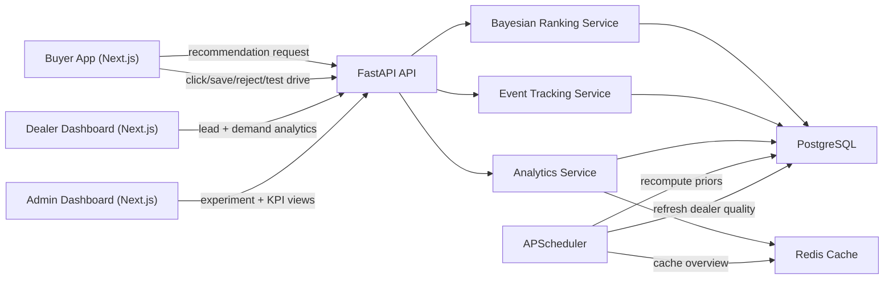

# Architecture

## Backend responsibilities

- `app/models`: relational schema for users, buyers, dealers, vehicles, events, recommendations, experiments, assignments, conversions, and priors.
- `app/services/recommendation.py`: buyer profile resolution, candidate scoring, MinMax-scaled revenue weighting, experiment assignment, and recommendation persistence.
- `app/services/bayesian.py`: prior lookup, event-driven posterior updates, and full recomputation from history.
- `app/services/analytics.py`: KPI aggregation, arm comparison, dealer dashboards, and cached overview snapshots.
- `app/services/seed.py`: deterministic demo data with historical marketplace activity.
- `app/jobs/scheduler.py`: recurring recomputation jobs.

## Frontend responsibilities

- `/buyer`: configurable buyer profile, explainable ranked matches, and live reranking after events.
- `/dealer`: authenticated dealer view for high-intent leads, vehicle demand, close-rate trend, pricing gaps, and response-time impact.
- `/admin`: authenticated experimentation dashboard for Bayesian-vs-heuristic comparison.

## Marketplace score composition

The heuristic arm emphasizes static rules:

- budget fit
- brand/body alignment
- distance
- inventory
- baseline dealer close rate

The Bayesian arm adds posterior signals from observed behavior:

- dealer posterior
- brand posterior
- body-type posterior
- financing posterior
- urgency posterior
- buyer behavior affinity from prior events

Both arms receive a revenue-aware adjustment using `scikit-learn` `MinMaxScaler` to normalize projected value across candidate vehicles before the final ranking sort.

